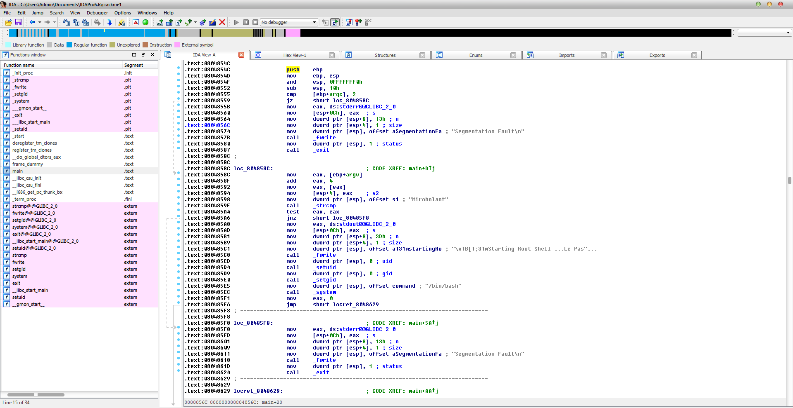
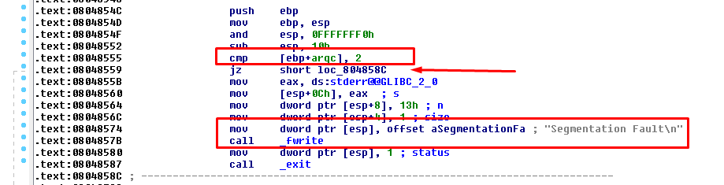
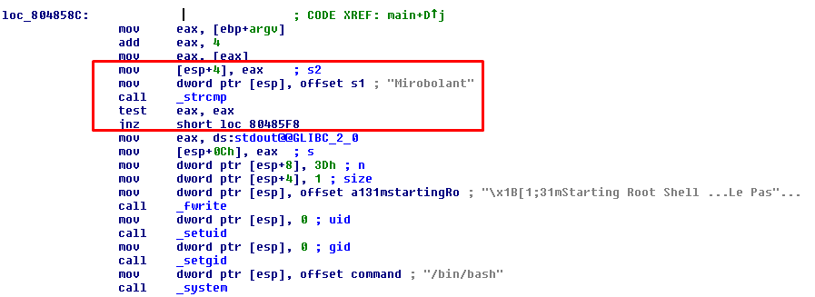

# CrackMe1 - Give me parameters

Pour ce challenge, nous n'avions qu'un fichier executable UNIX.

Si l'on essaye de l'executer, le programme nous affiche un message "Segmentation Fault"

Allons donc ;)

Pour savoir ce que cache ce programme, desassemblons le avec mon outil favori, IDA Pro.
On arrive sur le code assembleur de la fonction main, ce qui nous interesse le plus ici:



On repère déjà notre "Segmentation Fault", même deux !

Si on se penche un peu plus attentivement sur le code, on remarque le programme regarde le nombre de
paramètres donné au lancement et le compare avec 2:



Voila comment fonctionne cette première partie du programme, si il n'y a pas au moins un argument
donné au lancement, il affiche "Segmentation Fault" et quitte le programme.

Maintenant interessons nous à la suite, c'est a dire si l'on donne un argument:



On remarque que maintenant il va comparer l'argument donné avec la chaine "Mirobolant",
si ce n'est pas la même, on saute directement au deuxième "Segmentation Fault" et on quitte le programme.
Mais si l'argument est bien "Mirobolant", alors le programme affiche la chaine suivante dans la console:

> Starting Root Shell ...Le Pass est F.scAW8A9jRmk

Nous avons donc bien récupérer le flag !

Flag: F.scAW8A9jRmk

## Bonus: Equivalent C

Pour que vous puissiez comprendre, j'ai fais un code approximatif du code originel (C) du crackme

[crackme1.c]("crackme1.c")


```c
int main(int argc, char** argv)
{
	if(argc < 2)
	{
		printf("Segmentation Fault");
		exit(1);
	}
	if(strcmp(argv[1], "Mirobolant"))
	{
		printf("Starting Root Shell ...Le Pass est F.scAW8A9jRmk");
		setuid(0);
		setgid(0);
		system("/bin/bash");
	}
	else
	{
		printf("Segmentation Fault");
		exit(1);
	}
}
```

