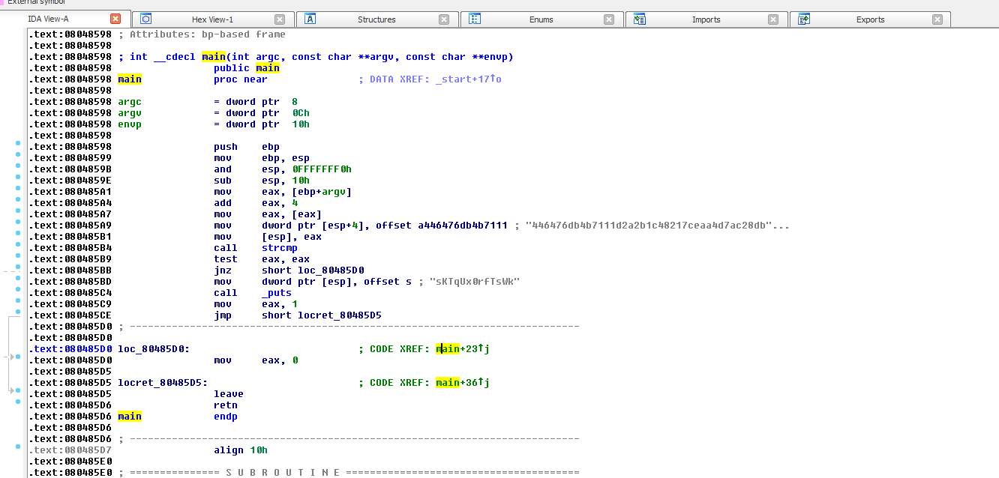
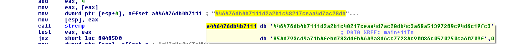
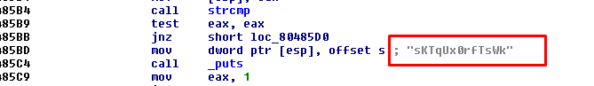

# CrackMe2 - Give me parameter again

Pour ce challenge, nous n'avions qu'un fichier executable UNIX.

Pour savoir ce que cache ce programme, desassemblons le avec mon outil favori, IDA Pro.
On arrive sur le code assembleur de la fonction main, ce qui nous interesse le plus ici:



Première remarque, le main est très petit, en effet le programme n'est pas bien difficile.

Si on se penche un peu plus attentivement sur le code, on peut voir que le programme
fais une comparaison de chaine de caractères entre un argument de lancement et une très
très longue chaine :'(



Mais pas de panique ! En fait, nous n'avons pas besoin de nous embeter avec cette chaine :)
Pourquoi ? Regardons simplement ce que fais le programme si l'argument est bien la chaine attendue:



Oh bah ca alors, une chaine de caractères est affichée à l'écran !
Et cette chaine est en réalité notre flag :)

> Flag: sKTqUx0rfTsWk

## Bonus: Equivalent C

Pour que vous puissiez comprendre, j'ai fais un code approximatif et simplifié du code originel (C) du crackme

[crackme2.c]("crackme2.c")


```c
int main(int argc, char** argv)
{
	if(strcmp(argv[1], "446476db4b7111d2a2b1c48217ceaa4d7ac28db4c3a68a51397289c94d6c19fc3854d793cd9a71b4febd783ddfb4649a3d6cc77234c90036c0570250ca60709f"))
	{
		printf("sKTqUx0rfTsWk");
	}
	exit(0);
}
```

