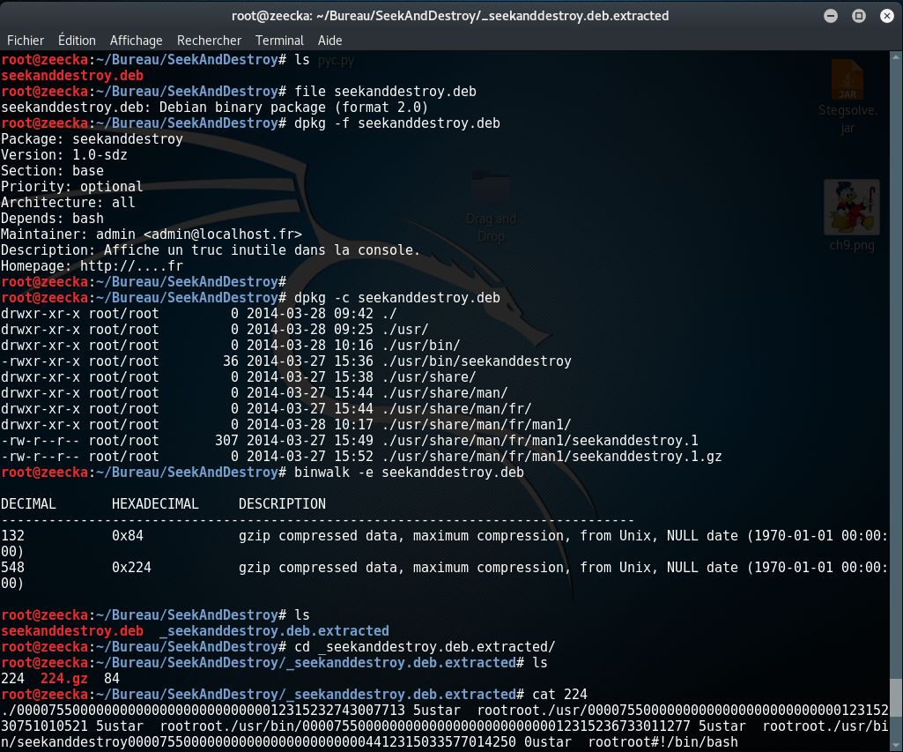
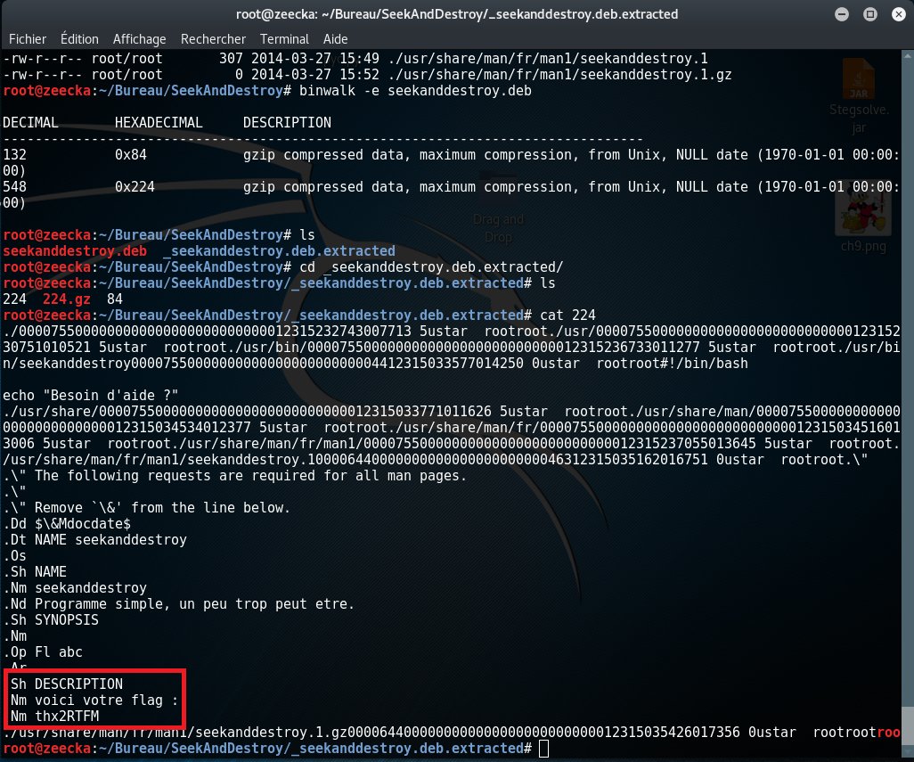

# seekanddestroy.deb 

Pour ce challenge, une archive debian (.deb) nous était fournis : [seekanddestroy.deb](seekanddestroy.deb)

Solution 1 : ouvrir avec l'installateur d'archive deb et naviguer vers usr/share/man/fr/man1/seekanddestroy.1 

(screen à venir)

Solution 2 : Utiliser binwalk et lire le contenu des fichiers présents:

==> thx2RTFM
