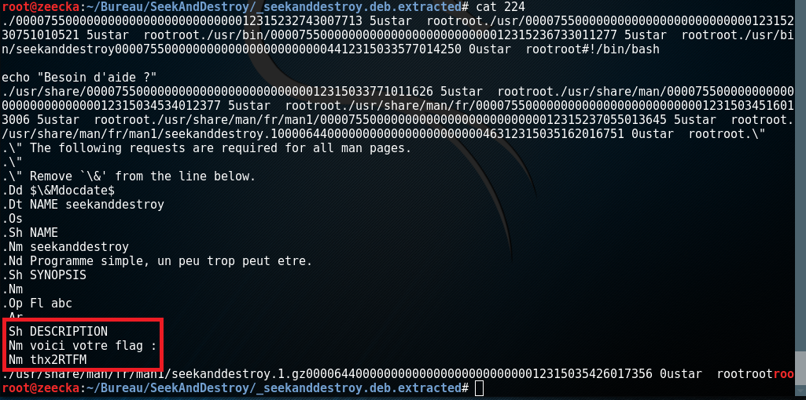

# seekanddestroy.deb 

Pour ce challenge, une archive debian (.deb) nous était fournis : [seekanddestroy.deb](seekanddestroy.deb)

## Solution 1 

ouvrir avec le gestionnaire d'archive et naviguez vers usr/share/man/fr/man1/seekanddestroy.1 

Ensuite il suffit de l'ouvrir et le flag apparait à la fin

## Solution 2 

Utiliser binwalk et lire le contenu des fichiers présents:

==> thx2RTFM
