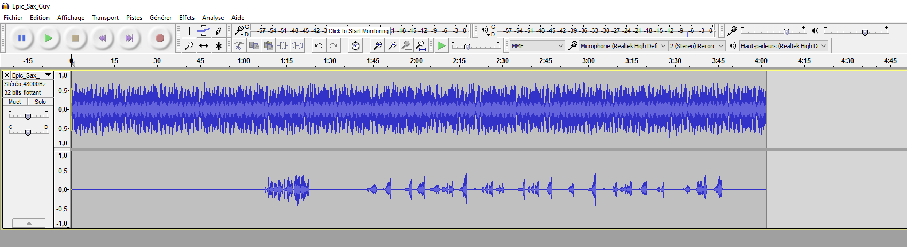
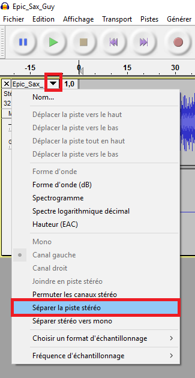
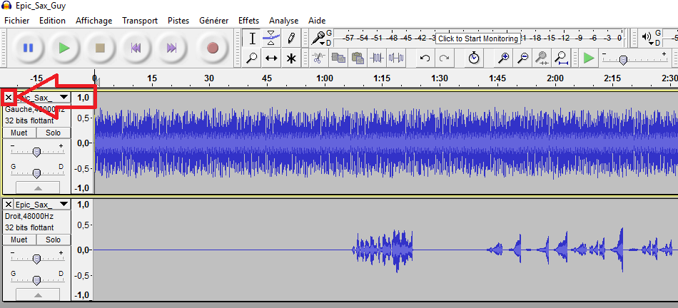
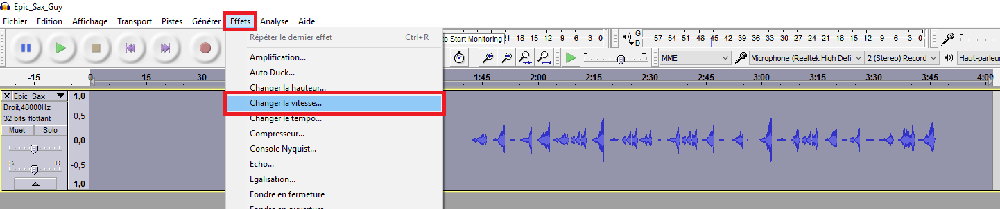
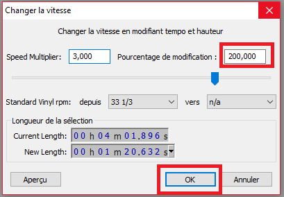
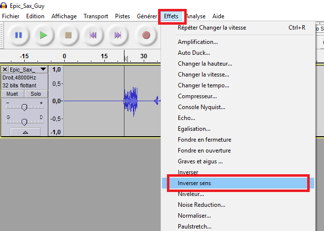
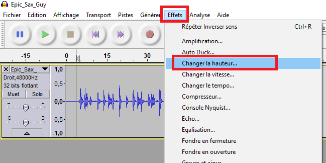
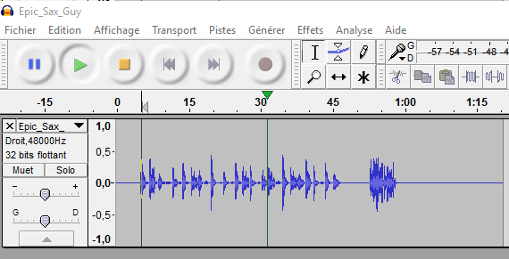

#Epic Sax Guy
Sur ce challenge, un fichier audio .wav nous était fourni:

[Epic_Sax_Guy.wav](http://www.mediafire.com/file/6la2pgvx1es0lbz/Epic_Sax_Guy.wav)

Après une première écoute, on entend d'une part que la piste est jouée sur la piste Gauche, et d'autre part, des bruits inhabituels à un durée d'environ 1:20 sur la piste Droite.

On ouvre donc le fichier sous Audacity:

On peut confirmer visuellement ce qu'on entendait à la première écoute, une musique sur la piste gauche et un son sur la piste droite.

On commence donc par isoler la piste Droite:

Ensuite, on accélère la piste:

On inverse son sens:

On peut commencer à entendre des mot/lettres, pour une text plus clair, on augmente la hauteure de la piste:

On obtien la piste:
[Epic_Sax_Guy_solve](http://www.mediafire.com/file/if2qe2hcdivcd9e/Epic_Sax_Guy_solve.wav)

Voilà ! A la lecture on peut entendre: 

Bien joué, le flag est: the[espace]cake[espace]is[espace]a[espace]#lie#

==> the cake is a #lie#
