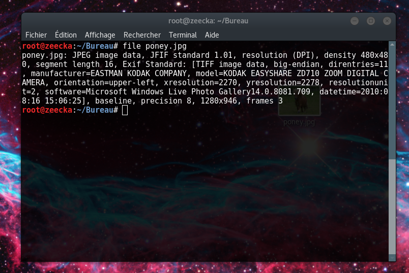

# Poney

L'épreuve proposait l'image d'un magnifique poney :

Pour commencer l'épreuve on fait un "file" de l'image pour vérifier de quel type il s'agit.

On utilise l'outil "binwalk" pour vérifier si'il existe des fichiers cachés dans l'image. L'option -e permet d'extraire ces fichiers.

Enfin on liste les fichier présents. Il y a un fichier "flag" et une archive qui contient elle aussi ce même fichier flag. On change l'extention du fichier flag en flag.pdf et on l'ouvre ! 

==> zolipon3y!yaf0undMeh
