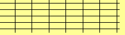

# 5 inscriptions en 10 secondes

5 incription en 10 secondes, avec un "captcha" ? C'est qu'indique la page "Aide" du challenge.

Le site proposait en effet un formulaire d'inscription avec à remplir:
* Un Nom
* Un Prénom
* Un EMail
* Un "Captcha"

Le formulaire contient également un champ caché : formulaire=1

Il faut donc réaliser une série de 5 inscriptions sur ce formulaire, tout en prenant soin de bien compléter le captcha.

Ce captcha nous demandait de rentrer le nombre de lignes verticales et horizontales présentes sur l'image.
Le nombre de lignes horizontales / verticales variait entre 1 et 10 pour chaque axe ce qui générait des captcha de cette forme :



Le captcha ci dessu demandait donc à l'utilisateur de rentrer la valeur 75 puisqu'il y a 7 lignes verticales et 5 horizontales.


Pour réaliser cet exploit, j'ai donc développé un script python 3 qui va inscrir à notre place 5 personnes, et résoudre le captcha à chaque fois ! 


La résolution du captcha utilise le plugin "PIL" (comme indiqué dans l'aide du site il me semble). Celle ci va compter le nombre de pixels noir sur la première lignes puis la première colone.

Voici le script utilisé pour résoudre l'épreuve :

[SolveInscriptionCaptcha.py]("SolveInscriptionCaptcha.py")


```python
# -*- coding: utf-8 -*-


# testé sous Python 3 !
# necessite le plugin PIL !

##############################
####    Code By Zeecka    ####
##############################
###    return(victoire)... ###
###       #equipe18        ###
###        IUT Vélizy      ###
##############################


import requests
from PIL import Image, ImageDraw

lienChall = "http://10.62.27.3/epreuve3/index.php" # Lien du formulaire de submit
lienImg = "http://10.62.27.3/epreuve3/images/code.php" # lien de l'image , c'est ce chargement qui set le session[captcha] / le timer
filename = r"C:\Users\Alex\Desktop\temp.png" # Place to save the captcha


def parseImage(url):
	""" Prend le chemin de l'image en param 
	retourne le nombre de lignes verticales et horizonales sous la form 57
	pour 5 lignes verticales et 7 horizonales """
	
	im = Image.open(url) # On ouvre l'image avec PIL
	pixels = list(im.getdata()) # On charge les pixels (liste 1d)
	width, height = im.size # On recup la taille de l'image
	pixels = [pixels[i * width:(i + 1) * width] for i in range(height)] # on converti en liste 2d de pixels
	
	nbVerticaux = 0 # On initialise les nb de lignes
	nbHorizontaux = 0
	
	for elt in pixels[0]: # on parcour la premiere ligne
		if elt == 0: # pour chaque pixel noir sur la premiere ligne, si la valeure est noire
			nbVerticaux += 1 # alors on incrémente le nombre de lignes verticales
	
	for elt in pixels: # pour chaques lignes 
		if(elt[0] == 0): # si le premier pixel est noir
			nbHorizontaux += 1 # on incrémente le nombre de lignes horizonales
	
	return str(nbVerticaux)+str(nbHorizontaux)


# NOM ET PRENOMS BIDON POUR L'INSCRIPTION
nomstab = ["Jean","Charles","George","Louis","Simon","Constant"]
prenomtab = ["naej","selrahc","egroeg","siuol","nomis","tnatsnoc"]


s = requests.Session() # On initialise la session (important pour assurer le suivi des inscriptions)

for i in range(5): # Boucle de 5 comptes
	
	""" On recup l'image """
	
	response = s.get(lienImg);
	
	with open(filename, 'wb') as f: # On écrit l'image sous le chemin "filename"
		for chunk in response.iter_content(1024):
			f.write(chunk)
	
	# On set les valeurs du formulaires
	
	captcha = parseImage(filename) # parsing du captcha, voir parseImage()
	nom = nomstab[i]
	prenom = prenomtab[i]
	mail = prenom+"."+nom+"@gmail.com"
	formulaire = "1" # parametre présent avec la val 1 sur le site

	mondico = { # On construit le dictionnaire de param post
	'captcha':int(captcha),
	'nom':nom,
	'prenom':prenom,
	'email':mail,
	'formulaire':formulaire
	}
	
	# On inscrit le compte
	
	print("Inscription du compte :")
	print(mondico)
	print("\n\n")
	
	""" Construction de la requetes post """

	r = s.post(lienChall, data = mondico)
	
	# On recup la réponse
	
	rep = r.text
	rep = rep.split("<!-- Content -->")[1] # on prend le contenu dans <!-- content --> <!-- /content -->
	rep = rep.split("<!-- /content -->")[0]
	
	# On affiche la réponse
	print(rep)
```

Je n'ai malheureusement plu le flag en tête mais l'execution du script renvoyait un phrase avec le flag ;) .
